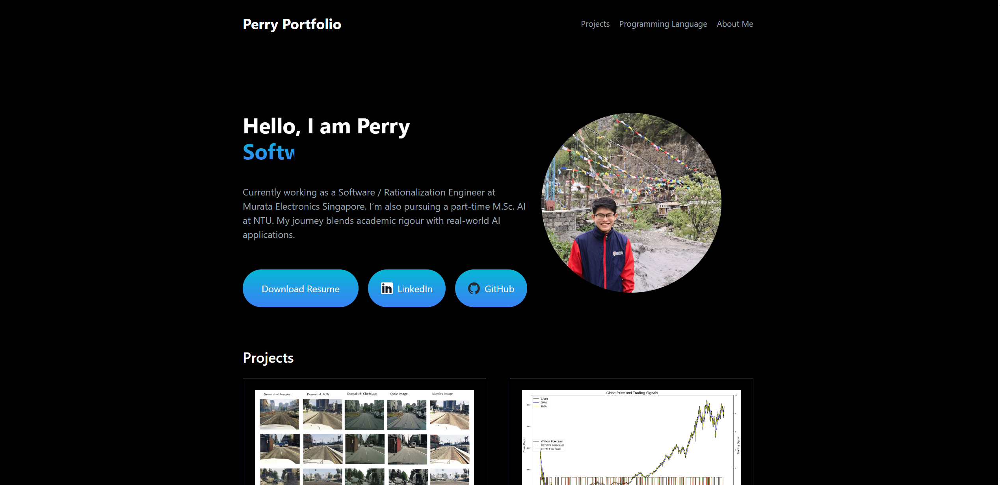

<!-- ------------------------------------------------------- -->
<!--  Perry Ong · Personal Portfolio (React + Vite + Tailwind) -->
<!-- ------------------------------------------------------- -->

# 🖥️ Personal Portfolio – Perry Ong

A clean, one‑page portfolio site that showcases my AI & software‑engineering projects, skill set, and career timeline.  
Built with **React 18**, **Vite**, and **Tailwind CSS** for lightning‑fast dev experience and deploys in seconds on Vercel/GitHub Pages.

<p align="center">
  
</p>

---

## ✨ Features

- **Instant Vite dev server & HMR** – save & see changes in <200 ms
- **Tailwind CSS v3** – utility‑first styling with dark theme already applied (`bg‑black`, `text‑white`)
- Animated **gradient typing** headline (`.gradiant-text`) built with vanilla CSS keyframes
- **Responsive** two‑column hero with circular profile photo
- Smooth‑scroll navigation + **scroll‑to‑top** button
- **Project cards** with external links and hover effects
- **Skill bars** (gradient progress)
- Vertical **career timeline** with scroll‑progress indicator
- Strict ESLint + Prettier config (airbnb‑lite) for consistent code style

---

## 🚀 Live Demo

> **Coming soon** – will be deployed to **https://perryongwq.github.io/portfolio** (or Vercel).  
> Feel free to clone and run locally ↓

---

## 🛠️ Tech Stack

| Layer          | Library / Tool                |
| -------------- | ----------------------------- |
| Build          | [Vite](https://vitejs.dev/)   |
| UI             | React 18, JSX, Hooks          |
| Styling        | [Tailwind CSS v3](https://tailwindcss.com/) |
| Lint / Format  | ESLint • Prettier             |
| Icons / SVG    | Lucide React                  |
| Deployment     | Vercel • GitHub Pages (optional) |

---

## 📦 Getting Started

```bash
# 1. Clone
git clone https://github.com/Perryongwq/portfolio.git
cd portfolio

# 2. Install deps
npm install           # or pnpm install / yarn

# 3. Run dev server
npm run dev           # > http://localhost:5173

# 4. Production build
npm run build         # outputs static files to /dist

# 5. Preview build locally
npm run preview
